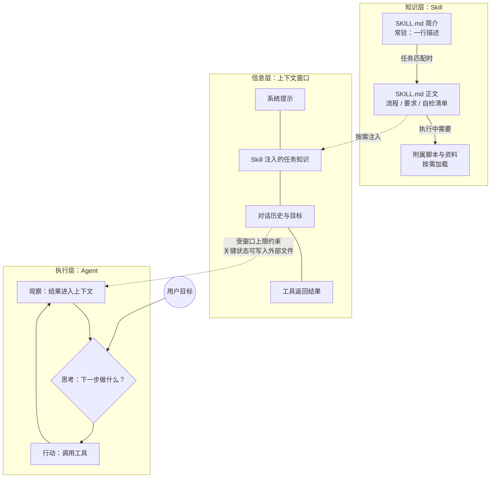

# 概念关系说明：Agent、大模型的上下文、Skill

> 三个概念不是三个孤立的名词，而是同一个 AI 系统里各司其职的三个层面。
> 本文先分别用一句话锚定每个概念，再说明它们如何互相咬合。

## 一、一句话锚定

| 概念 | 一句话定位 | 在系统中的角色 |
|---|---|---|
| 大模型的上下文（Context） | 模型作答那一刻"看得见的全部信息"，有窗口上限 | **信息层**：一切决策的输入 |
| Agent（智能体） | 围绕目标自主"思考→行动→观察→再思考"的执行者 | **执行层**：干活的主体 |
| Skill（技能） | 沉淀成文件夹的可复用任务知识，按需注入上下文 | **知识层**：让干法可沉淀、可复用 |

## 二、三者如何互相咬合

### 1. 上下文如何影响 Agent 的工作

Agent 的每一步决策——"下一步做什么、用哪个工具、要不要继续"——都只依据**当前上下文窗口里的信息**做出（详见 [llm-context.html](llm-context.html) 第四节）。因此上下文直接决定 Agent 的工作质量与上限：

- **看得全 → 判断准**：目标、环境反馈、工具返回结果都在窗口内，Agent 才能正确规划。
- **被挤出 → 就失忆**：长任务中早期进展被截断出窗口，Agent 会重复劳动或丢失约定。
- **塞太满 → 被干扰**：无关信息占据窗口，重要指令可能被"淹没"（迷失在中间）。
- **外部存储兜底**：成熟的做法是让 Agent 把关键状态写入文件（外部记忆），需要时再精准读回窗口，而不是指望对话历史无限延续。

### 2. Skill 如何沉淀可复用的任务知识

Skill 把"某类任务该怎么做"从单次对话中抽出来，固化成带元数据的文件夹（SKILL.md + 附属脚本与资料，详见 [skill.html](skill.html) 第四节）。它通过**渐进式加载**与上下文协作：

- 平时只有一行简介常驻（几乎不占窗口）；
- 命中相关任务时，正文才加载进上下文，按需再读附属资源；
- 于是"专家经验"变成可版本管理、可分享、可迭代的资产，而不是散落在聊天记录里的只言片语。

### 3. 合起来看

**Agent 是执行者，上下文是它的"视野"，Skill 是按需发放的"操作手册"。**
没有上下文，Agent 无从判断；没有 Skill，Agent 每次遇到同类任务都要从头摸索，且好做法无法积累。

## 三、关系流程图（Mermaid）

要点：实线是知识层的内部按需加载；虚线是 Skill 内容注入上下文、Agent 决策循环依赖上下文的双向关系。**上下文窗口是三者唯一的衔接面**——Skill 靠它生效，Agent 靠它思考。

## 四、一个闭环实例（本仓库自身）

本仓库的作业过程就是三者协作的完整闭环：

1. **Skill 沉淀**：我把"如何学习一个概念"的方法写成 `concept-study-guide`（[SKILL.md](../.workbuddy/skills/concept-study-guide/SKILL.md)）——知识层。
2. **Agent 执行**：调用该 Skill 学习 Agent / 上下文 / Skill 三个概念时，智能体加载 SKILL.md，按八段式结构生成资料——执行层。
3. **上下文衔接**：SKILL.md 的生成规范进入上下文窗口指导生成，三份资料（[agent.html](agent.html) / [llm-context.html](llm-context.html) / [skill.html](skill.html)）本身又成为可再次进入上下文的参考资料——信息层。
4. **再次沉淀**：生成结果经人工核查修正后提交到 Git，Skill 和资料都可继续迭代——知识资产随版本积累。

## 五、我的判断（个人理解）

- **三者的关系可以概括为"一个执行者 + 一块视野 + 一套手册"**：Agent 的价值在自主循环，但循环的质量被上下文锁死；Skill 是目前看到的、对"上下文这个稀缺资源"最优雅的使用方式——按需、精准、可积累。
- **我认为三者中上下文是更底层的约束**：Agent 和 Skill 都是围绕"如何用好有限上下文"演化出来的方案（Agent 用循环+工具把大任务切成小上下文步骤；Skill 用渐进加载把知识压缩到一行简介）。
- **一个可能的误区**：把三者当成"越大越好"——Agent 越自主越好、窗口塞得越满越好、Skill 装得越多越好。实际上三者都有各自的节制原则：高风险操作要人工确认、上下文要筛选压缩、Skill 只为可复用的任务而建。
